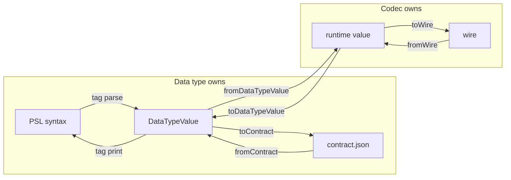

# A data type owns its value; a codec converts it

Draft for discussion. Nothing is decided until Will says so.

## At a glance

A SQLite column with a date default:

```prisma
model Event {
  id Int      @id
  at DateTime @default("2024-01-01T00:00:00Z")
}
```

Today that one instant is held as two different texts:

| Where | Text | Written by |
| --- | --- | --- |
| `contract.json` | `"2024-01-01T00:00:00Z"` | the codec's `encodeJson`, trimmed to match a separate "canonical form" function |
| `CREATE TABLE … DEFAULT` | `'2024-01-01T00:00:00.000Z'` | the codec's `encode` |
| every row the app writes | `2024-01-01T00:00:00.000Z` | the codec's `encode` |

Verify, the planner and the test kit each carry extra code whose only job is to make the two texts compare equal.

**The decision.** A data type owns its value: how it is written in PSL, what it looks like in the contract, and which other types' values it takes. A codec converts that value to and from the runtime value an application sees, and to and from the wire, and defines nothing. What passes between them is a `DataTypeValue`: a value together with its type. The separate "canonical form" functions are deleted.

After the change, the same column:

| Where | Text |
| --- | --- |
| PSL | `` at DateTime @default(datetime`2024-01-01T00:00:00Z`) `` |
| `contract.json` | `"2024-01-01T00:00:00.000Z"` |
| `DEFAULT` clause and rows | `2024-01-01T00:00:00.000Z` |

One text, one owner.

## The value and its four representations

A value has four representations. Two belong to the data type, two to the codec.



| Representation | Example (`pg/timestamptz`) | Owner |
| --- | --- | --- |
| PSL syntax | `` timestamptz`2024-01-01T00:00:00Z` `` | data type, through its tag |
| `DataTypeValue` | `{ type: 'pg/timestamptz', value: "2024-01-01T00:00:00Z" }` | data type |
| runtime value | `Temporal.Instant`, or `Date`, or a string | codec |
| wire | `2024-01-01 00:00:00+00` | codec |

**`DataTypeValue`** is an instance of the type: the value as the type defines it, with its type and the type's parameters attached, `{ type, params, value }`. `numeric(10,2)` refuses `1.234` and `vector(3)` refuses four elements in the type's constructor, which takes the parameters. A parameter a codec owns, such as the `schema` of `arktype/json@1`, stays the codec's: the type checks that the value is a document, the codec checks the document against the schema at runtime. Only the type constructs one, and the constructor refuses a value the type does not hold, so nothing downstream can produce an invalid one. Its `value` is what `contract.json` stores: ISO text for a date, digit text for `pg/int8`, a document for `pg/jsonb`. Two `DataTypeValue`s are equal when their types match and their values are equal as canonical JSON. This is the handover point between the two owners: everything before it is authoring and storage, everything after it is runtime.

## The pieces

**A data type represents a value we store.** `pg/timestamptz`, `pg/int8`, `sqlite/datetime`. It declares:

- its PSL syntax: a tag for a value whose text has its own grammar (`` timestamptz`…` ``, `` json`…` ``), or one of the plain forms (a quoted string is `pg/text`, a number is classified, `true`/`false` is the boolean type);
- `fromContract(json): DataTypeValue` and `toContract(value): json`, which read and write the stored form;
- the casts it accepts: pure functions from another type's `DataTypeValue` to its own;
- the database type it is stored as, with its parameters: `pg/timestamptz` is stored as `timestamptz(p)`, which the catalog reports as `timestamp(p) with time zone`; `sqlite/datetime` is stored as `text`.

Several types may be stored as the same database type. On SQLite, `sqlite/datetime`, `sqlite/json` and `sqlite/text` are all stored as `text`. The stored-as declaration is a fact about the type, not its identity.

**A codec converts a `DataTypeValue` to and from the two runtime representations.** It has four methods:

| Method | From | To |
| --- | --- | --- |
| `fromDataTypeValue` | `DataTypeValue` | runtime value |
| `toDataTypeValue` | runtime value | `DataTypeValue` |
| `fromWire` | wire | runtime value |
| `toWire` | runtime value | wire |

A codec never sees `contract.json`. Several codecs may represent one type and differ only in the runtime value: `pg/timestamptz@1` gives a `Date`, `pg/timestamptz-temporal@1` a `Temporal.Instant`, `pg/timestamptz-string@1` a string. The test kit asserts for every codec that `toDataTypeValue(fromDataTypeValue(v))` equals `v`, and that `toDataTypeValue(fromWire(toWire(fromDataTypeValue(v))))` equals `v`. `fromWire`/`toWire` are today's `decode`/`encode`, renamed so the four methods read as one family.

**A tag is PSL syntax for a value whose text has its own grammar.** Its `parse` reads the body into a `DataTypeValue`; its `print` does the reverse for `contract infer`. New tags: `date`, `time`, `timetz`, `timestamp`, `timestamptz`, `interval`, `bytea` on Postgres; `datetime` on SQLite. Unprefixed, because the target owns the type. Nothing outside PSL reading ever sees a tag.

**A cast converts a value of one type into another.** `pg/int4 → pg/int8` turns a number into digit text; `pg/json → pg/jsonb`; `pg/int4 → pg/numeric`. Casts exist for authoring, where a literal of one type is written at a position of another. There is no cast from the text type into a date or JSON type: a date is written with its tag, and `@default("2024-01-01T00:00:00Z")` on a date column is refused with a message that shows the tag.

## Scenarios

### Postgres `timestamptz`

```prisma
createdAt DateTime @default(timestamptz`2024-01-01T00:00:00Z`)
```

1. The `timestamptz` tag parses the body: `{ pg/timestamptz, "2024-01-01T00:00:00Z" }`.
2. The contract stores `"2024-01-01T00:00:00Z"` under the column, whose `dataType` is `pg/timestamptz`.
3. `db init` loads the column, calls `fromContract`, hands the `DataTypeValue` to the column's codec: `fromDataTypeValue` gives `Temporal.Instant`, `toWire` gives `2024-01-01 00:00:00+00`, and the adapter writes the `DEFAULT` clause.
4. A row read back: `fromWire` gives `Temporal.Instant`. An app using `pg/timestamptz@1` gets a `Date` from the same column and the same contract.

Three codecs, one contract form. Switching the app from `Date` to `Temporal` does not change the contract hash. `date`, `time`, `timetz`, `timestamp` and `interval` have the same shape.

### Postgres `int8`

```prisma
count BigInt @default(9007199254740993)
```

The number is classified `pg/int8` by size: `{ pg/int8, "9007199254740993" }`, digit text so no digit is lost. A smaller number is classified `pg/int4` and reaches the column through the cast `pg/int4 → pg/int8`. Codecs `pg/int8@1` (`bigint`) and `pg/int8number@1` (`number`).

### Postgres `jsonb`

```prisma
meta Jsonb @default(json`{"a":1}`)
```

The `json` tag yields `{ pg/jsonb, {"a":1} }`. `Jsonb @default("{}")` is refused: a quoted string is `pg/text`, and `pg/jsonb` declares no cast from it. Unchanged; this is the shape every other type now follows.

### SQLite `datetime`

```prisma
at DateTime @default(datetime`2024-01-01T00:00:00Z`)
```

Type `sqlite/datetime`, stored as `text`. Codec `sqlite/datetime@1`. Its value is ISO text in UTC with the millisecond fraction always written, `2024-01-01T00:00:00.000Z`, which is also what `toWire` writes, so the `DEFAULT` clause, every row and the contract hold one text. Same shape as Postgres.

### SQLite `json`

Type `sqlite/json`, stored as `text`. The `json` tag yields `sqlite/json`; its value is canonical JSON text with sorted keys and no whitespace, so a hand-edited default in another key order is not drift. `Json @default("hello")` is refused by the tag. `String @default(json`…`)` is refused too: `sqlite/text` declares no cast from `sqlite/json`.

### SQLite integers

One type, `sqlite/integer`, 64-bit, value digit text. Codecs `sqlite/integer@1`, `sqlite/bigint@1`, `sqlite/bigintnumber@1`. There is no `sqlite/bigint` type: the database enforces no narrower range, so `bigint` versus `number` is only the runtime value, which is a codec's business.

### Enum columns

```prisma
role Role @default(ADMIN)
```

`pg/enum` has a `typeName` parameter, but the members live in the contract's `types` block, not on the type. The type's constructor checks that the value is a string. Membership is checked by the column, which holds the enum declaration, before the value is stored.

### Lists

```prisma
tags      String[]          @default(["a", "b"])
embedding pgvector.Vector(3) @default([0.1, 0.2, 0.3])
```

A list column's `DataTypeValue` is an array of element values of the element type, and a codec maps its conversions over the elements. A type that takes a list literal on a column that holds one value, such as `pgvector/vector`, declares a cast from the list type, so the second line is a list of three `pg/numeric` values cast into one vector.

### SQL expressions

```prisma
createdAt DateTime @default(sql`now()`)
```

The `sql` tag yields a value of `sql/expression`, the one type no column has. A column default is either a `DataTypeValue` of the column's type, stored as the `literal` kind, or a `sql/expression` value, stored as the `function` kind. Verify compares the second as expression text, as it does today, because the database holds the expression and not a value.

## Verify

Verify checks that the database satisfies the contract. For each column it compares two things the contract declares with two things introspection reports:

- **Storage.** The type the contract's data type is stored as, with the contract's parameters, against the type the catalog reports. `sqlite/datetime` is stored as `text`; the catalog says `TEXT`; satisfied. `pg/timestamptz` with precision 3 is stored as `timestamptz(3)`; the catalog says `timestamp(3) with time zone`; satisfied. Verify does not resolve the catalog's text back to a data type; that is `contract infer`'s job.
- **Default.** The contract's `DataTypeValue` against the database's. Postgres reports a default as `'2024-01-01 00:00:00+00'::timestamp with time zone`; SQLite reports the literal the `DEFAULT` clause holds. In both cases the body is wire text, so introspection reads it with the column's codec, `fromWire` then `toDataTypeValue`, and compares `DataTypeValue`s.

No normalising helper, no cast, no tag.

## Other paths

- **TypeScript builder.** `.default(value)` hands the codec a runtime value; `toDataTypeValue` gives the value the contract stores. Already right.
- **Prisma 7 reader.** `DateTime @default("2024-01-01T00:00:00Z")` in a Prisma 7 schema is read through the date type's tag `parse`, so adoption needs no user edit.
- **`contract infer`.** Prints a tagged type with its tag and `print`; numbers, text and booleans print plainly.
- **Planner.** The expected default text is `fromDataTypeValue` then `toWire` through the column's codec, the same as the adapter writes. The planner's per-codec branches go.

## Mongo

Mongo has the same four representations: PSL literal, contract value, runtime value, BSON on the wire. Its data types declare the BSON types they are stored as, which is the same stored-as declaration without a DDL name, and its codecs have the same four methods under today's names. `DataTypeValue`, `fromContract`/`toContract` and the renames apply to Mongo mechanically. Mongo gets no date tags, and its verification, which runs through the JSON schema validator, does not change.

## The break users see

Every Prisma 8 PSL schema that writes a date default as a quoted string stops compiling:

```text
Field "Event.at": pg/timestamptz does not take a pg/text value. Write the date with its tag: @default(timestamptz`2024-01-01T00:00:00Z`).
```

The user writes the tag and nothing else changes: the stored value is the same, so no contract hash moves and no database is re-signed. Prisma 7 adoption is unaffected, because the Prisma 7 reader translates `@default("…")` on a `DateTime` field itself. `contract infer` prints the tag from then on, and the repository's examples change with it.

## What changes

Delete: `toCanonicalForm` on data types and codec descriptors, `canonicalFormOf`, every cast from the text type that parses, the planner's codec-id branches, the test kits' canonical-form pass-through, the "re-emit the contract" refusal.

Add: `DataTypeValue`; `fromContract`/`toContract` on data types; `fromDataTypeValue`/`toDataTypeValue` on codecs; the tags listed above; the data types `sqlite/datetime` and `sqlite/json`; the test kit's round-trip assertions; introspection reading defaults through the codec; the Prisma 7 reader using the tags' `parse`.

Rename: `encode`/`decode` to `toWire`/`fromWire`; `encodeJson`/`decodeJson` become `toDataTypeValue`/`fromDataTypeValue`.

Rewrite: ADR 254's "Canonical form", "Casts", "Written values" and SQLite paragraphs; ADR 184 as a whole (the codec no longer owns contract serialization); the slice 3 plan's verify step; the project design where it describes SQLite's types.

## Alternatives considered

- **Codecs define the contract form.** Rejected: several codecs share one type, so the form would depend on which codec the app chose, and a Postgres contract would change hash when the app moved from `Date` to `Temporal`.
- **A separate `toCanonicalForm` function per type, which codecs call.** What exists today. Rejected: a second definition of the same form beside the tag's `parse`, and on SQLite it had to live on the codec, giving two owners.
- **Dates as quoted strings, read through a cast from the text type.** Rejected: a cast from text is a parser in disguise, exists for no other reason, and makes every date column accept any string until the cast refuses it. A tag says what the value is.
- **A `sqlite/datetime` type stored as its own database type (`DATETIME`).** SQLite would keep the declared name and introspection could tell the types apart. Rejected: every existing column would need a table rebuild, and the same move for JSON corrupts data, because a column declared `JSON` has numeric affinity and stores the document `"42"` as the integer 42.
- **`sqlite/datetime@1` as a codec of `sqlite/text`.** Rejected: `sqlite/text` has no reader for a date, so the reader had to live on the codec, which is the two-owner problem.
- **A richer in-memory value per type than its contract form.** Rejected for now: every type we have is well served by its contract form as its value, with canonical JSON equality; the only things that need more are the codecs, and that is their runtime value. A type that needs structure can hold it in `value` as a JSON object without changing the design.
